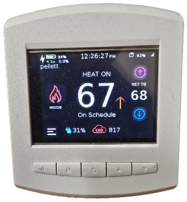

# Ready Touch 2.8

Desktop or wall mount ESP-32 with 2.8" TFT

## Quick start:
Attach power to the DC/AC screw terminal connector located on the back, or plug in power adapter to the jack located inside 5.5x2.1 type
by removing the back case 2 screws.
USB power: Unscrew the back case with two screws. Break away the tabs by the USB connector using long nose pliers (see photos)
to access USB plug with your cable if you wish to use it on your desktop.
The tabs are left in place incase you want to wall mount for a nice look using OTA for updates instead of USB.

Power on by pressing center power button for at least one second. A sample application is loaded and source located here.

Example program:
Press any button to see the display B1 - B4 beep and indicated press.
Temperature will display on the screen using the on-board DS18B20 sensor via one wire DS248.
Time will display from the RTC DS3231.
SD card will be detected when plugged in or removed.
Lower touch screen buttons control the three relays.
Press the power button for at least 5 seconds to power off.

Use the included application for examples on GPIO etc programing usage.

## Product Details:
esp32 s3 2MB PSRAM | Ready Touch | Development | Desktop Case

## Features:
ESP32-S 2MB PSRAM
Thermostat style enclosure.
Desktop Case L bracket.
Wall mount bracket.
320 x 240 color touch screen ILI9488 with touch screen TSC2046 controller.
LCD backlight brightness controllable via GPIO.
Piezo speaker controllable via GPIO LED PWM etc to set your own frequency and loudness.
Power controller. Press 1 second on, 5 seconds off.
3 2A latching relays. Set the relay on or off and it latches requiring no extra power. 6 GPIOs to set on off states.
Jumper to connect power to relay contact to supply power to external screw terminal if you wish to connect high power relays.
Battery management I2C MAX1704 and MCP73831 lion charger.
2-pin JST-PH Lithium-ion polymer connector. Please only use battery with internal protection circuit such as Adafruit versions.
Charge LED visible from the side.
SD card slot accessable from side of case.
USB port accessable from side of case. Surge protection and reverse diode protection from connected power supply.
Real time temperature compensated clock DS3231 I2C with backup battery holder.
One-Wire I2C DS248. Connect as many devices as you like. Connector supplying resettable fuse for power and signal.
DS18B20 tempature sensor.
Optional SCD41 sensor.
2 GPIO inputs. EOL (end of line 2k security system to monitor short, open, contact closure, contact open) or simply connect contact.
2 power connectors 5-24v AC/DC. 5.5/2.1 connector or screw terminal
Boot reset buttons.
4 gpio buttons located on the front of the case.
Prototype area to add your own IC. GPIO and I2C available at that location.

## Usage:
Unit can sit on your desktop for easy development. Desktop case makes it easy to see and press the screen or buttons. Use it for weather,
fridge monitoring, thermostat, the list goes on.

## PCB:

## Package included:
ESP32 board (mounted inside enclosure)
Plastic enclosure
Desktop L bracket
Wallmount bracket

Schematic NOT included. I don't provide technical assistance please make sure you are familiare with the product before purchasing.

Please, for your saftey use only Lithium Ion Polymer Battery with protection like the ones offered on Adafruits site.

Documention can be found on the WeGoWireless.com website.

## From the creator
Thank you,
from WeGoWireless.com. I appriciate your interest in my products. Much time has been spent by me to offer this to everyone.
Hope you like it!